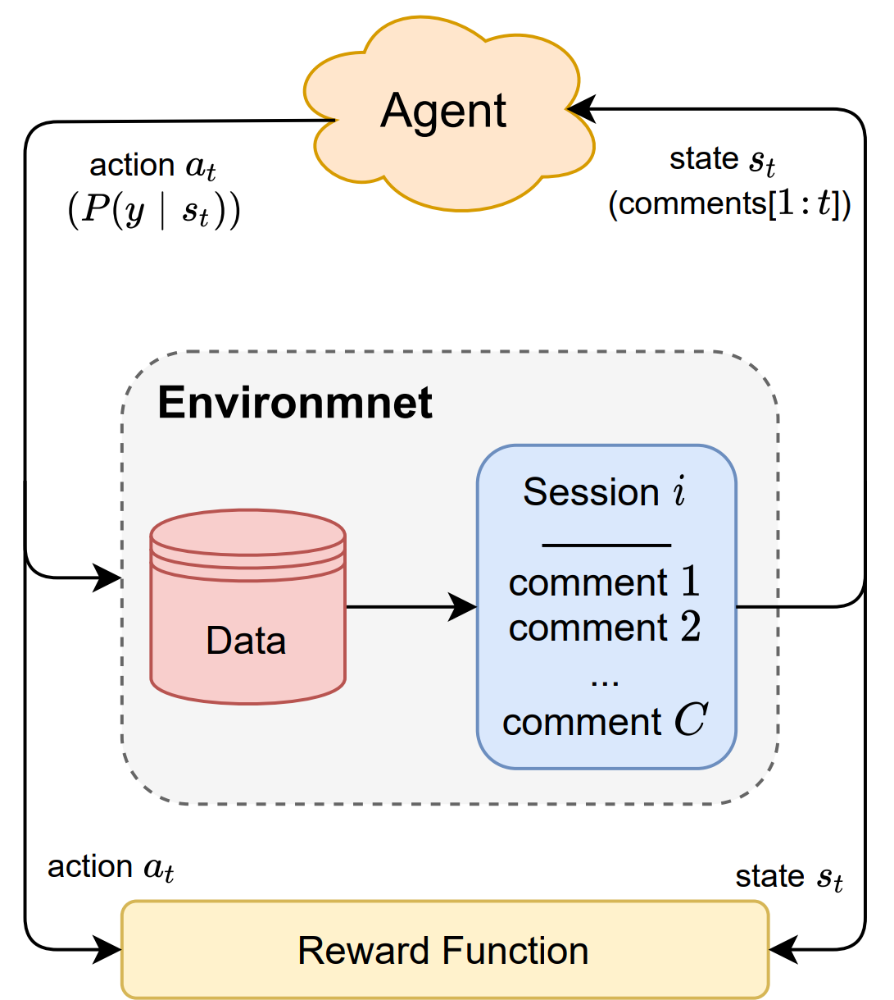

# Mitigating Bias in Session-based Cyberbullying Detection
Implementation of the ACL21 paper: Mitigating Bias in Session-based Cyberbullying Detection

<p align=center>


## Code usage
The source code is written in Python and is a Jupyter notebook. To use the code:

[1] Install the requirements using the following command:
```bash
pip install -r requirements.txt
```

[2] Please refer to https://jupyterlab.readthedocs.io/en/stable/getting_started/installation.html for installing JupyterLab. After installation, you can use the following terminal command to run JupyterLab and open the shared notebook:
```bash 
jupyter lab
```

[3] For the dataset, please refer to the following papers:
```
[1] Homa Hosseinmardi, Sabrina Arredondo Mattson, Rahat Ibn Rafiq, Richard Han, Qin Lv, and Shivakant Mishra. 2015. Analyzing labeled cyberbullying incidents on the instagram social network. In Socinfo. Springer, 49–66.

[2] Rahat Ibn Rafiq, Homa Hosseinmardi, Richard Han, Qin Lv, Shivakant Mishra, and Sabrina Arredondo Mattson. 2015. Careful what you share in six seconds: Detecting cyberbullying instances in Vine. In ASONAM. ACM, 617–622.
```

### Python packages version
* seaborn==0.11.1
* torch==1.7.0
* matplotlib==3.3.2
* pandas==1.2.0
* numpy==1.19.2
* ipython==7.20.0
* scikit_learn==0.24.1

### Reference
> [Lu Cheng](http://www.public.asu.edu/~lcheng35/), [Ahmadreza Mosallanezhad](https://davood-m.github.io), [Yasin N. Silva](http://www.public.asu.edu/~ynsilva/), [Deborah L. Hall](https://newcollege.asu.edu/deborah-hall), and [Huan Liu](http://www.public.asu.edu/~huanliu/). **Mitigating Bias in Session-based Cyberbullying Detection: A Non-Compromising Approach**. _The Joint Conference of the 59th Annual Meeting of the Association for Computational Linguistics and the 11th International Joint Conference on Natural Language Processing (ACL-IJCNLP 2021)_, 2021.